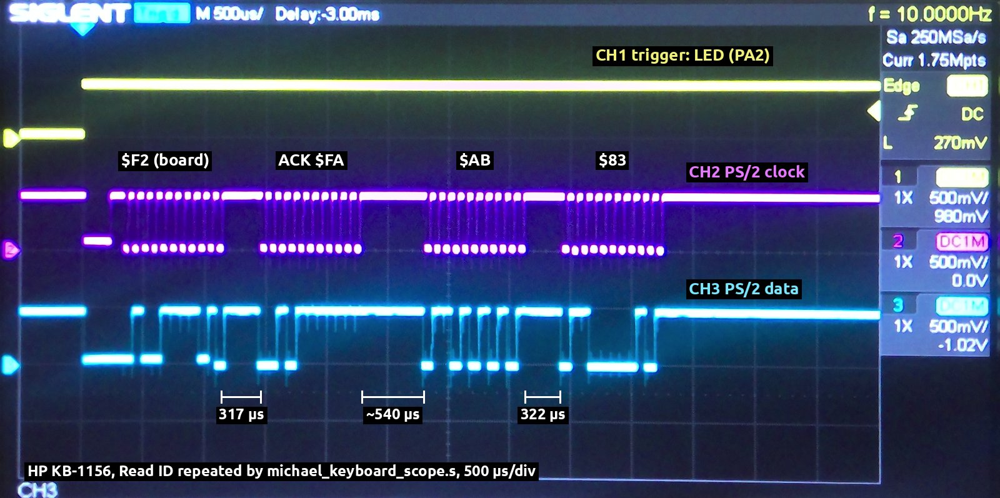
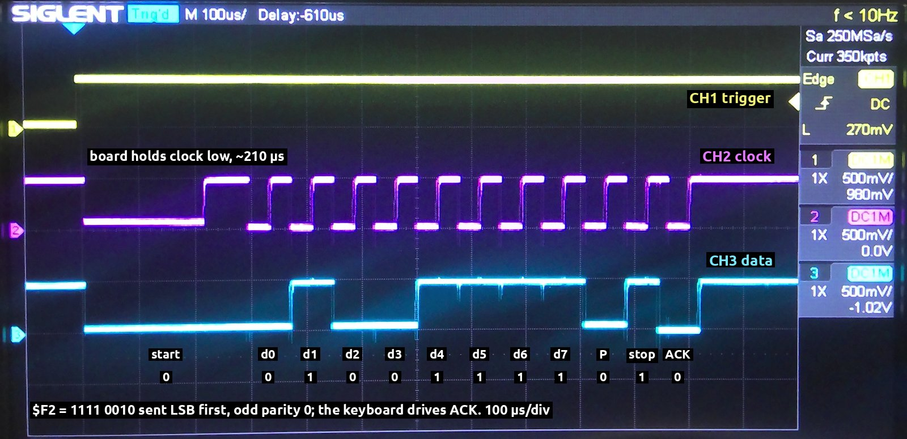

# Michael: PS/2 frame detection and fast keyboards

Findings from 2026-09-30 and 2026-10-01. With some keyboards, Michael's keyboard board can't separate the bytes of a command's reply. The driver then never sees the ACK and `keyboard_send_command` hangs. This document records the measurements, the cause, the recommended hardware change and what is still to do.

## Symptom

`firmware/programs/michael/michael_keyboard_info.s` sends Read ID (`$F2`) and shows the reply:

| Keyboard | Result |
|---|---|
| Adesso EasyTouch mini | `ID AB 83 Set 02` |
| Perixx PERIBOARD-409 Mini | `ID AB 83 Set 02` |
| HP KB-1156 | `ID AB 83 Set 02` |
| MC Saite MC-689 | hangs after showing `ID` |

The MC-689 works with every other test program, typing included. `michael_keyboard_diag.s` shows its arrow keys' four-byte sequences intact (`E0 12 E0 74 E0 F0 74 E0 F0 12` for Right Arrow with Num Lock on). With `$F2` added after start-up, the diagnostic ended `F2bcd[AB]`. The `$F2` went out, but the first byte back was `$AB`, not the ACK `$FA`, and `$83` never arrived.

## How the board finds the end of a byte

The schematic is [`michael-bidirectional-PS2-keyboard-interface-schematic-v-1.0.pdf`](../hardware/michael/schematics/michael-bidirectional-PS2-keyboard-interface-schematic-v-1.0.pdf).

The keyboard clock, inverted by U1D, shifts the keyboard data, inverted by U1C, into two 74HC595s (U2, U3) on each falling edge of the PS/2 clock. The data is inverted, so the driver flips each byte it reads (`eor #$ff`). A frame detector (bottom left of the schematic) drives IRQ, which goes to the VIA's CA2:

- While the clock is low, U1F's output is high. It charges C1 (10 nF) through R2 (220 Ω) and D3 within a few µs, and U1E drives IRQ low.
- While the clock is high, D3 blocks, so C1 discharges only through R1 (10 kΩ), with a time constant τ of 100 µs. IRQ goes high when C1 falls to U1E's lower threshold VT−.
- IRQ also clocks the 74HC595s' storage registers (RCLK), so the byte the CPU reads (REG_OE, from SOEB) is latched as IRQ rises.

So CA2 goes low when the keyboard clock starts and goes high again once the clock has been idle for a fixed time, which this document calls the **idle time**. The driver (`firmware/lib/keyboard/keyboard_driver.inc`) treats a falling CA2 edge as the start of a frame and a rising edge as its end. On the rising edge it reads the byte through SOEB.

The idle time was measured on the board at **about 92 µs** (88–95 µs on a scope; see [measurements](#measurements)). The emulator assumes 150 µs (`DETECT_IDLE_US` in `emulator/chips/ps2_keyboard_board.c`).

### The R1/C1 values match the measured idle time

C1 discharges from about VCC less a diode drop, about 4.4 V, so the idle time is τ × ln(4.4 V / VT−). A 74HC14's VT− is typically about 1.7 V at 5 V, which gives 100 µs × ln(4.4 / 1.7) = 95 µs. The measured 88–95 µs corresponds to a VT− of 1.7–1.8 V.

The spread comes from how fully C1 charged during the frame's last clock-low phase, and from part-to-part variation in VT−. Within a frame the clock is high for only about 38 µs, so C1 falls only to about 3 V and IRQ stays low.

## Cause

If the keyboard starts its next frame less than the idle time after the previous one ends, CA2 never goes high between them. The driver sees one long frame and reads only the last byte. The shift register has already shifted the earlier one out.

| Keyboard | Clock period | Gap between reply bytes | Gap between scan code bytes |
|---|---|---|---|
| Adesso | about 81 µs, some as short as 75 µs (high for 39 µs) | 203 µs or more, varying up to 528 µs | not measured |
| Perixx | about 85 µs | about 530 µs | 2 ms or more |
| HP KB-1156 | about 77 µs (high for 37 µs) | 540 µs and 322 µs | 1.8 ms or more |
| MC-689 | about 74 µs (high for 38 µs) | **92 µs** and 98 µs | 5 ms or more |

- The Adesso's, the Perixx's and the HP's gaps are much longer than the idle time, so each frame is seen separately.
- The MC-689 leaves 92 µs between `$FA` and `$AB`, and on a scope CA2 stays low across the gap. The two frames came as a single burst of 1735 µs. The `$FA` was lost and the driver read `$AB`. It goes on waiting for an ACK that never comes.
- Then `$83` was lost too. Its gap is 98 µs, just over the idle time, and CA2 is high for only 4 µs before `$83`'s first clock. The interrupt handler takes about 20 µs to switch CA2 back to the falling edge. So it misses `$83`'s start, and then its end.

The MC-689 sends scan codes with wider gaps, so typing works. Only command replies come back to back.

### Why changing the idle time is only a stopgap

The idle time has to be longer than the clock's high phase, or a frame would end in the middle. It also has to be shorter than the shortest gap between frames. For the four keyboards measured here that is possible. On a scope, the clock is high for 37 µs (HP), 38 µs (MC-689) and 39 µs (Adesso), and the Perixx's period suggests about 42 µs. The shortest gap is the MC-689's 92 µs. So an idle time of about 60 µs would separate every frame, with about 20 µs of margin either side. Changing R1 from 10 kΩ to 6.8 kΩ (or C1 from 10 nF to 6.8 nF) makes τ 68 µs and the idle time about 61–65 µs. That's about 25 µs above the measured high phases (and still above the PS/2 maximum of 50 µs) and about 27 µs below the MC-689's 92 µs gap.

But PS/2 allows a high phase of up to 50 µs and a gap of only 50 µs, so no idle time works for every keyboard. Each frame's start would also still race the interrupt handler. With a 64 µs idle time, CA2 would be high for about 34 µs before the MC-689's `$83`, against the handler's 20 µs.

## What IBM's PS/2 reference says

The passages below are quoted from IBM's *Personal System/2 Hardware Interface Technical Reference*, First Edition (May 1988), section "Keyboards (101- and 102-Key)". Copies are on [bitsavers](https://bitsavers.org/pdf/ibm/pc/ps2/Personal_System_2_Hardware_Interface_Technical_Reference_May88.pdf) and the [Internet Archive](https://archive.org/details/ps-2-hardware-interface-technical-reference-ocr). OCR typos are corrected. In IBM's wording, a line is *active* when it is high and *inactive* when it is low; the *system* is the host, here the board.

**Frame format** (page 38, "Data Stream"):

> Data transmissions to and from the keyboard consist of an 11-bit data stream (Mode 2) sent serially over the 'data' line.

Figure 18 (page 39) lists the bits: a start bit (always 0), data bits 0 (least significant) to 7, a parity bit (odd parity) and a stop bit (always 1).

**Keyboard to board** (page 39, "Data Output"):

> If the 'clock' and 'data' lines are both active, the keyboard sends the 0 start bit, 8 data bits, the parity bit, and the stop bit.

> If line contention occurs before the leading edge of the 10th clock signal (parity bit), the keyboard buffer returns the 'clock' and 'data' lines to an active level. If contention does not occur by the 10th clock signal, the keyboard completes the transmission.

**Board to keyboard** (page 40, "Data Input"):

> ...the system forces the keyboard 'clock' line to an inactive level for more than 60 microseconds while preparing to send data. When the system is ready to send the start bit (the 'data' line will be inactive), it allows the 'clock' line to go to an active (high) level.

> If a system request-to-send signal (RTS) is detected, the keyboard counts 11 bits. After the 10th bit, the keyboard checks for an active level on the 'data' line, and if the line is active, forces it inactive, and counts one more bit. This action signals the system that the keyboard has received its data.

> If the keyboard 'data' line is found at an inactive level following the 10th bit, a framing error has occurred, and the keyboard continues to count until the 'data' line becomes active. The keyboard then makes the 'data' line inactive and sends a Resend command.

> Each system command or data transmission to the keyboard requires a response from the keyboard before the system can send its next output. The keyboard will respond within 20 milliseconds unless the system prevents keyboard output.

**The ACK byte** (page 27, "Commands to the System"):

> Acknowledge (Hex FA): The keyboard issues ACK to any valid input other than an Echo, or Resend command. If the keyboard is interrupted while sending ACK, it discards ACK and accepts and responds to the new command.

What this means here:

- **Two different ACKs.** Only frames from the board to the keyboard end with an acknowledge bit (IBM's "line-control bit"), and the keyboard drives it. Frames from the keyboard have no acknowledge bit. Separately, the keyboard answers each valid command or argument byte with a whole `$FA` frame, within 20 ms. That `$FA` is what `keyboard_send_command` waits for.
- **11 clock pulses each way.** The keyboard clocks all 11 bits of its own frames. For the board's frames, the start bit goes out with the board's release of the clock (the RTS). The keyboard then clocks the other 10 bits (data, parity, stop) and "one more bit", the acknowledge, so again 11 pulses. The scope photo of the board sending `$F2` (under [measurements](#measurements)) shows exactly this.
- **The board holds the clock low for about 210 µs before sending,** more than the 60 µs required.
- **Response time:** an ACK timeout in the driver must allow at least 20 ms.

## Recommended hardware change: count the clock pulses

End each frame on its **11th clock pulse** (start bit, 8 data bits, parity, stop bit) instead of after an idle time:

1. **Counter:** a 74HC161 (4-bit counter: asynchronous clear, synchronous load) clocked on the PS/2 clock's **rising** edge, the end of each clock pulse. A spare 74HC14 gate (U1A) re-inverts U1D's output for it. Each bit has already shifted into the 74HC595s on the falling edge before, so the 11th rising edge means a whole frame.

   Not the falling edge the 74HC595s shift on: the clears below let go only after the clock falls (the RC idle detector's IRQ falls 1–2 µs later, once C1 has charged through R2 past U1E's threshold). A counter clocked on falling edges would miss the first pulse of every frame that follows an idle gap.
2. **Frame complete:** decode a count of 11 (`1011`: Q3·Q1·Q0; 15 can't be reached) as *frame complete*, for example with a 74HC11, and send it to CA2 in place of IRQ. It rises at the end of the 11th pulse and stays high until the next frame's first pulse ends. So every frame produces a rising edge, however short the gap.

   The board's own frames to the keyboard have 11 pulses too: 8 data bits, parity, stop and the keyboard's line ACK. The start bit goes out while the board holds the clock low (see [What IBM's PS/2 reference says](#what-ibms-ps2-reference-says)). So *frame complete* also marks the end of the board's frame, which is where the driver now counts a byte as sent.
3. **Back-to-back frames:** while the count is 11, hold the counter's LOAD active with the inputs set to 1. The next frame's first pulse then loads 1 instead of counting to 12. This is what handles narrow gaps such as the MC-689's, where the RC idle detector never fires between frames.
4. **Clears:** two conditions clear the counter, combined into its active-low CLR with a diode-AND or a 74HC08:
   - **Idle:** the existing RC idle detector (U1F, R1, R2, D3, C1, U1E), with IRQ inverted by the other spare 74HC14 gate (U1B). It clears the counter whenever the clock has been idle for about 92 µs. That throws away partial frames (a frame cut off by the board, a glitch, or a keyboard plugged in while running). Its timing no longer decides where a frame ends.
   - **The board holding the clock:** KBD_CLK_OUT (SOLB, J2 pin 4) is low while the board holds the clock low. Stretch its release by a few µs (a small RC with a diode: fast to assert, slow to release) so it still clears the counter at the rising edge when the board lets the clock go. The board's frame then counts exactly the keyboard's 11 pulses. The idle detector can't do this: it sees the hold as a busy clock, and a keyboard may start clocking sooner than the idle time after the release (about 80 µs on the HP; see the scope photo).

   | Situation | What makes the next frame's first pulse count as 1 |
   |---|---|
   | A gap longer than the idle time (the Adesso, Perixx and HP) | The idle clear resets the counter to 0 |
   | A gap shorter than the idle time (the MC-689's 92 µs) | The reload at a count of 11 (step 3) |
   | The board sending a command | The KBD_CLK_OUT clear, held past the release |
   | A glitch, or a frame cut off partway | The idle clear, at the next idle gap |
5. **Latch the byte:** clock the 74HC595s' storage registers (RCLK) with *frame complete*, in place of IRQ, so the byte the CPU reads stays put while the next frame shifts in. The next frame can start as little as 50 µs after the last one (92 µs on the MC-689), which is less time than the interrupt handler can count on to read it.

The RC idle detector could go, with the KBD_CLK_OUT clear as the only clear. But then a counter put out of step by the keyboard (a glitch, or plugging it in while the board runs) would stay out of step until the board next sent a command. The driver's stop and parity checks (below) would only catch it after a few wrong bytes. For two gates of the existing 74HC14 and a few passive parts, keeping it is worth it.

Another option uses no new chips: route the keyboard clock to a free VIA input (e.g. CB1) and count the bits in software. That costs one interrupt per bit (about 11 per byte, at 60–100 µs intervals). The board's spare pins and the cost in interrupt time would need checking.

### Software changes the hardware change needs

- **Driver:** each rising CA2 edge is one whole frame. Leave CA2 on the rising edge and drop the start/end toggling (`KEYBOARD_RECEIVING`). This also removes the race that lost `$83`.
- **Driver:** check each frame's stop and parity bits. DE (the last bit in, the stop bit) is on PA5 (`ACK` in `base_config_v2.inc`) and DP (parity) on PA6, inverted like the data. The driver already switches both pins to inputs when it reads a byte, but doesn't check them. On an error, hold the clock low (which also clears the counter) and send Resend (`$FE`), as IBM describes. On the board's own frames DE is the keyboard's line ACK, so the driver can check that too.
- **Driver:** before sending, the driver waits until no frame is in progress (`KEYBOARD_RECEIVING`), because IBM says the board must let a frame finish once it is past the 10th clock. With the start/end toggling gone, it needs another sign of that, such as IRQ (low while the clock is busy) on a spare VIA input. PA0 and PA1 aren't assigned in `base_config_v2.inc`; check whether either is free on the board.
- **Driver:** `keyboard_send_command` waits for CA2 to fall after pulling the clock low (trace step `b`). With the counter, CA2 no longer falls then, so it needs another way to time the hold, such as a fixed 100 µs delay.
- **ROM:** the driver is built into the Michael ROM (`firmware/boards/michael/michael_services.inc`). Rebuild `hardware/michael/michael_rom.bin` and reprogram the EEPROM.
- **Emulator:** update the frame detector model in `emulator/chips/ps2_keyboard_board.c` to match.

## Measurements

Both programs are in `firmware/programs/michael/`, and the emulator tests in `tools/tests/test_michael_keyboard.py` keep them building. Values are hex T1 ticks of 0.5 µs at 2 MHz. These are the 2026-10-01 runs. Earlier versions of the programs gave the same results on 2026-09-30. Both programs read T1 with `read_t1` (`firmware/lib/core/read_t1.inc`). Reading the low byte and then the high byte, as the timing program first did, sometimes gives a count that is off by `$100`. One HP run showed frames of `$810` and `$611` among ones of `$710`. The Perixx and MC-689 logs below were taken that way, but each matched a second run to within a few ticks.

**Idle time** (`michael_keyboard_frame_detector.s`): the program holds the clock low with SOLB, releases it, and times CA2's rising edge. The time each read takes is fixed, so readings vary only by the 7-cycle loop that polls for the edge.

| | Readings |
|---|---|
| Board | `00B5 00B5 00B6 00B6 00B5 00BC 00B6 00B6` |
| Emulator, which models 150 µs (300 ticks) | `0133` × 8 |

That's about 181 ticks, or 91 µs. On a scope (below), the idle time is the gap less the time CA2 was high: 414 − 324 = 90 µs and 98 − 4 = 94 µs with the MC-689; 203 − 112 = 91 µs, 528 − 440 = 88 µs and 205 − 110 = 95 µs with the Adesso. The calculations below use 92 µs (184 ticks).

**Frames** (`michael_keyboard_frame_timing.s`): the program sends Read ID and logs each CA2 interrupt. Each entry is a type, a byte and the time since the previous entry:

| Type | Meaning |
|---|---|
| `b` | clock pulled low |
| `c` | clock released, plus 300 µs |
| `h` | end of the host's frame |
| `s` | frame start |
| `a` | end of an ACK frame |
| `r` | end of a frame with another byte |

Then it logs the next key typed (`a` here: `1C`, then `F0 1C` for the release) to time single frames from the same keyboard. Don't touch the keyboard until the first log appears.

| Keyboard | Read ID | Key `a` |
|---|---|---|
| Perixx | `b000000 c000465 h00149F s00023C aFA07AD s00037A rAB07A9 s000368 r8307A9` | `s000000 r1C07AE s003CFA rF007AE s000F1E r1C07AF` |
| MC-689 | `b000000 c000465 h0008A5 s00028B rAB0D8E` | `s000000 r1C06CC s00B0B8 rF006CC s002919 r1C06C9` |
| HP KB-1156 | `b000000 c000474 h0004D9 s0001C1 aFA070B s00037F rAB070F s0001CA r83070F` | `s000000 r1C070E s00A840 rF00711 s000DA0 r1C070E` |
| Emulator | `b000000 c000465 h000E01 s0006A6 aFA080C s0006A2 rAB080C s0006A4 r83080D` | `s000000 r1C080A s0006A4 rF0080D s0006A5 r1C080A` |

**Oscilloscope** (`michael_keyboard_scope.s`, which sends Read ID about every 100 ms and raises the LED output, PA2, as a trigger). A gap is the time the clock is high from one frame's last clock to the next frame's first:

| Keyboard | Gap | CA2 during the gap | Worked out from the T1 log |
|---|---|---|---|
| HP | `$F2` to ACK: 317 µs | | 316 µs |
| HP | `$AB` to `$83`: 322 µs | | 321 µs |
| MC-689 | `$F2` to ACK: 414 µs | high for 324 µs | 418 µs |
| MC-689 | ACK to `$AB`: 92 µs | stays low | 88 µs |
| MC-689 | `$AB` to `$83`: 98 µs | high for 4 µs | |
| Adesso | ACK to `$AB`: varies, down to about 205 µs | high for 110 µs at 205 µs | |
| Adesso | `$AB` to `$83`: varies, 203 µs to 528 µs | high for 112 µs to 440 µs | |

Within a frame the clock is high for 37 µs (HP), 38 µs (MC-689) and 39 µs (Adesso). The Adesso's clock period, from rising edge to rising edge, is about 81 µs, with some periods as short as 75 µs. The Adesso's gaps change from one Read ID to the next; the table gives the shortest and longest seen.

The whole Read ID exchange on the HP KB-1156 (500 µs/div). After the trigger the board holds the clock low, then come four frames: the board's `$F2` and the keyboard's ACK, `$AB` and `$83`:

The board sending `$F2` (100 µs/div). The data line is low (the start bit) while the board holds the clock low. Then the keyboard clocks 11 pulses about 77 µs apart. The board changes the data while the clock is low, and the keyboard reads it on each rising edge: d0–d7 LSB first, parity, stop. On the 11th pulse the keyboard drives the data line low itself as its line ACK:

How the table under [Cause](#cause) comes from these:

- **Single frame:** the time from a frame's start (`s`) to its end (`r` or `a`) is the frame's clocking plus the idle time. That's `$7AD` (1965 ticks) for the Perixx, `$70F` (1807 ticks) for the HP and `$6CB` (1739 ticks) for the MC-689. Less the idle time (184 ticks), the clocking takes 10.5 clock periods (from the start bit's falling edge to the stop bit's rising edge). That gives clock periods of about 85 µs, 77 µs and 74 µs.
- **Perixx and HP gaps:** an `s` comes the gap minus the idle time after the previous end. So the Perixx's gaps between reply bytes are 890 + 184 and 872 + 184 ticks, about 530 µs. The HP's are 895 + 184 and 458 + 184 ticks, about 540 µs and 321 µs.
- **MC-689 merged burst:** the burst (`$D8E`, 3470 ticks) is two frames' clocking plus the gap plus one idle time. A single frame is one frame's clocking plus one idle time. So the gap is the burst minus two single frames plus the idle time: 3470 − 2 × 1739 + idle = idle − 8 ticks. That's 4 µs less than the idle time, whatever its exact value: about 88 µs, against 92 µs on the scope. On 2026-09-30 the burst was `$D93`, giving idle − 3 ticks.

## TODO

- [x] Run `michael_keyboard_frame_detector.s` and `michael_keyboard_frame_timing.s` on the board with the MC-689, the Perixx and the HP KB-1156 (2026-10-01; results above).
- [x] Measure the MC-689's and the Adesso's gaps between reply bytes and their clock high times, and check the T1 method, on a scope (2026-10-01; results above).
- [x] Check the board against its schematic (now [`michael-bidirectional-PS2-keyboard-interface-schematic-v-1.0.pdf`](../hardware/michael/schematics/michael-bidirectional-PS2-keyboard-interface-schematic-v-1.0.pdf)): the RC values (R1 10 kΩ, C1 10 nF, τ = 100 µs, which match the measured idle time), which edge the 74HC595s shift on (the PS/2 clock's falling edge) and what drives their RCLK (IRQ, the frame detector's output).
- [ ] Decide between the stopgap (R1 6.8 kΩ, an idle time of about 64 µs) and the counter-based frame detector (above), build it and test it with all four keyboards.
- [ ] Driver, ROM and emulator changes for the counter-based detector (above).
- [ ] Until then, consider a timeout on the ACK wait in `keyboard_send_command`, so a fast keyboard (or none) can't hang the board. It must allow at least the 20 ms IBM gives a keyboard to respond. `michael_keyboard_info.s` would then show `--` for the MC-689. The bytes would still be lost.
- [ ] Model the board's frame in the emulator as 11 clock pulses after the clock is released (`HOST_FRAME_BITS` is 12). Set the emulator's `DETECT_IDLE_US` to the measured 92 µs, and add a keyboard option that sends reply bytes like the MC-689 (92 µs, then 98 µs apart), so the hang can be reproduced in `tools/tests/test_michael_keyboard.py`.
