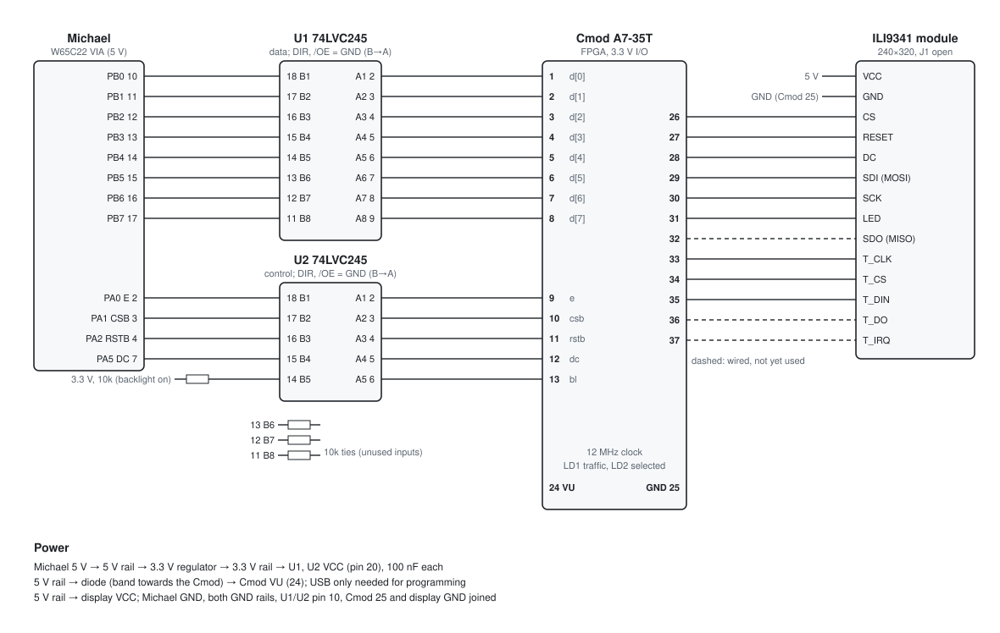

# Michael: FPGA SPI display interface

A Digilent Cmod A7-35T between Michael's VIA and the ILI9341 240×320 TFT. It replaces an earlier interface
board that had no schematic. Michael's display driver,
[`firmware/lib/graphics/graphics_display.inc`](../../../../firmware/lib/graphics/graphics_display.inc), is
unchanged: the FPGA reproduces what that driver expects.

- Wiring, pin by pin: [`WIRING.md`](WIRING.md)
- Schematic: [`schematic.svg`](schematic.svg), drawn by [`schematic.py`](schematic.py)
  (`python3 schematic.py > schematic.svg`)
- Design: [`rtl/spi_bridge.v`](rtl/spi_bridge.v) (the interface), [`rtl/top.v`](rtl/top.v) (pins, backlight,
  touch, LEDs); testbench [`sim/tb_top.v`](sim/tb_top.v)



## What Michael's driver expects

There was no schematic for the old board, so its behaviour was worked out from the driver:

| Signal | VIA pin | How the driver uses it | What the FPGA does |
|---|---|---|---|
| D0–D7 | PB0–PB7 | Written before each E pulse, held until after E falls. | Latches the byte on E's rising edge. |
| E | PA0 | One high pulse per byte: `tsb`/`trb` in `gd_send_data`, or `sta PORTA,Y`/`stx PORTA` in the fill loops (a byte every 9 cycles, 4.5 µs at 2 MHz, E high for 2 µs). | One byte per rising edge. Level changes are ignored. |
| DC | PA5, shared with the LCD's RS and the keyboard's START/ACK | Low for command bytes, raised again only after E falls. | Latched with the byte, because the keyboard interrupt can drive PA5 at any time. |
| CSB | PA1 | Low for a whole session (`gd_select` … `gd_unselect`). | Strobes count only while CSB is low; port B and PA5 carry other traffic otherwise. Display CS is low while CSB is, and until the last byte is out. |
| RSTB | PA2, shared with Michael's LED | `gd_reset` holds it low for 10 ms and waits 120 ms, before `gd_select`. | Drives the display's RESET directly, not gated by CS, and abandons any byte in progress. |
| Backlight | none | Michael has no pin left for it. | The level on the spare buffer input (B5) is copied to the display's LED pin. It's tied high for now. |

## Timing

The FPGA runs from the Cmod's 12 MHz clock and sends SPI mode 0, MSB first, at 6 MHz. That's within the ILI9341's
10 MHz write limit. A byte takes 16 clocks after a 2–3 clock input synchroniser: about 1.5 µs.

Michael's fastest loop sends a byte every 9 CPU cycles, 4.5 µs at 2 MHz. So the interface keeps up with any
CPU clock up to about 5 MHz with no handshake, which is why the buffers only go one way. A faster CPU would need a
faster SPI clock (the Cmod's MMCM can provide one) or a FIFO.

## Building and loading

Needs the [artix7-open-toolchain](https://github.com/pjdennis/artix7-open-toolchain) kit. Either
`source <kit>/env.sh` first, or keep a checkout of the kit next to this repository as
`../fpga-toolchain-research`.

```bash
cd hardware/michael/fpga/spi-display
make            # simulate, then build build/top.bit and the compact build/top.fast.bit
make prog       # load into the FPGA (until power-off)
make flash      # write the Cmod's flash: the interface then starts on its own at power-up
```

The Cmod runs from Michael's 5 V through its VU pin, so USB is only needed for programming.

## Bring-up

1. Before connecting Michael: with the Cmod on USB, `make flash`. LD1 and LD2 stay off and the backlight is on.
2. Connect Michael and power up. The display shows nothing until a program initialises it.
3. Upload a graphics program, e.g.
   `tools/upload/compile_and_upload_michael.sh firmware/programs/michael/michael_graphic_display_test.s`.
   LD2 lights while the display is selected, and LD1 flashes while bytes go out.

## Reserved for later

- **Backlight brightness:** drive B5 from a spare output (or PWM it in the FPGA) instead of the tie.
- **Reading the display:** SDO (MISO) is wired to Cmod pin 32, but nothing reads it yet.
- **Touch:** the XPT2046's pins are wired (Cmod 33–37). The FPGA holds T_CS high so it stays idle.
