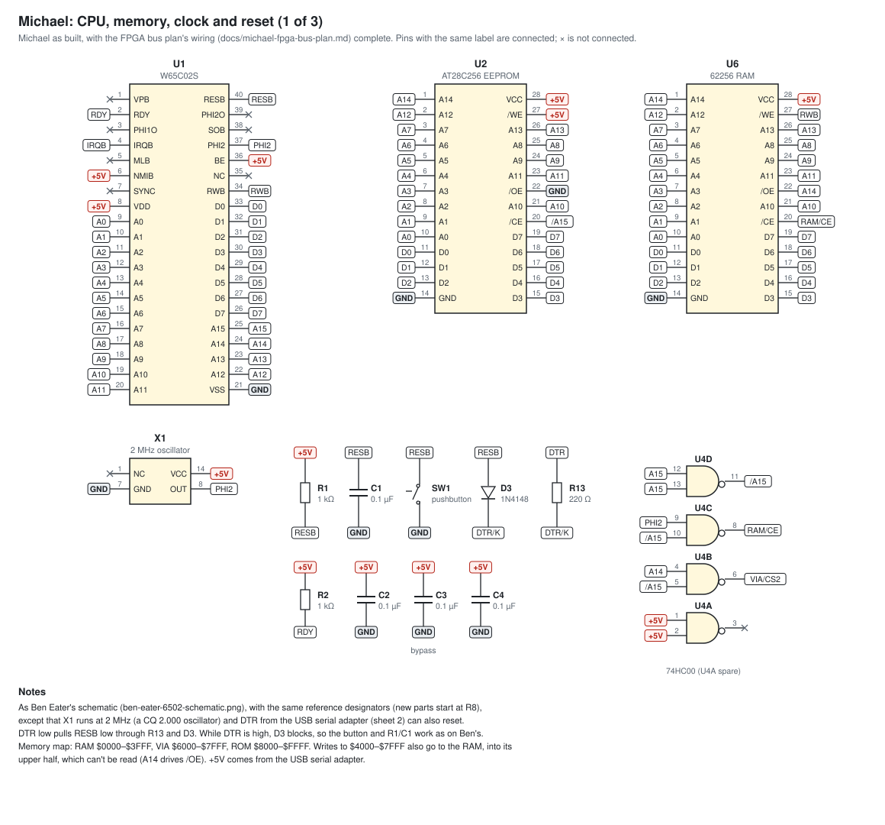
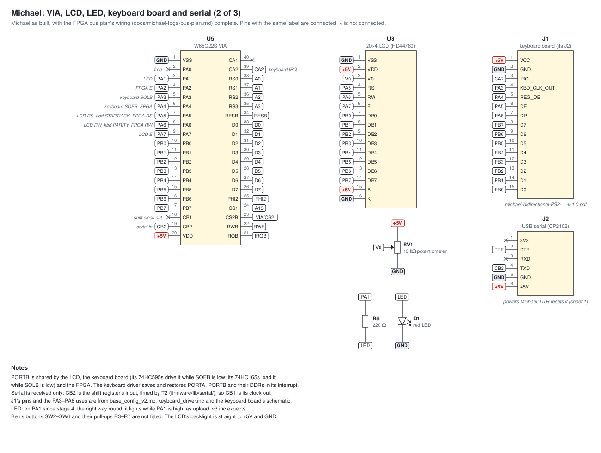
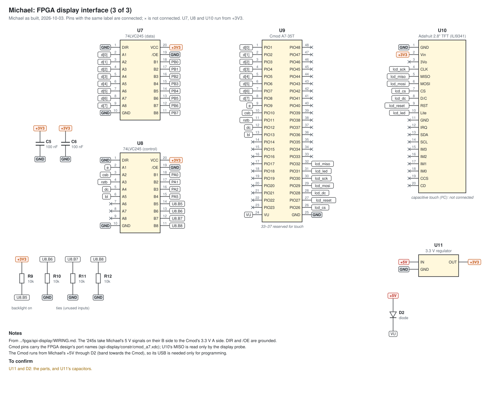

# Michael's schematics

| File | What it is |
|---|---|
| [`michael-core.svg`](michael-core.svg) | Sheet 1 of Michael as built (2026-10-04, from the code and photos of the board): CPU, EEPROM, RAM, address decode, clock and reset. |
| [`michael-io.svg`](michael-io.svg) | Sheet 2: the VIA and what's connected to it (LCD, LED, keyboard board, USB serial adapter). |
| [`michael-fpga-display.svg`](michael-fpga-display.svg) | Sheet 3: the FPGA bus and the display (two 74LVC245s, the Cmod A7-35T and the ILI9341 display). [`../fpga/spi-display/WIRING.md`](../fpga/spi-display/WIRING.md) has the same connections as tables. |
| [`parts.md`](parts.md) | The parts list for the three sheets. |
| [`planned/`](planned/) | The same three sheets once the [FPGA bus plan](../../../docs/michael-fpga-bus-plan.md) is complete: [`michael-core.svg`](planned/michael-core.svg) (unchanged), [`michael-io.svg`](planned/michael-io.svg) (E on PA2, the LED on PA1 the right way round, PA0 free) and [`michael-fpga-display.svg`](planned/michael-fpga-display.svg) (the bus wiring), with their own [`parts.md`](planned/parts.md). |
| [`michael_schematic.py`](michael_schematic.py), [`schematic_svg.py`](schematic_svg.py) | Draw both sets and their parts lists: `python3 michael_schematic.py` rewrites them. |
| [`ben-eater-6502-schematic.png`](ben-eater-6502-schematic.png) | Ben Eater's 6502 computer, which Michael's core matches. |
| [`michael-bidirectional-PS2-keyboard-interface-schematic-v-1.0.pdf`](michael-bidirectional-PS2-keyboard-interface-schematic-v-1.0.pdf) | The keyboard board (KiCad, v1.0). Sheet 2 shows only its connector. |

The sheets join parts with net labels: pins whose labels match are connected, and × marks a pin left open. They and the parts lists are meant to be enough to build Michael from. Parts identified only from a photo are marked "(or similar)".

[`tools/tests/test_michael_schematic.py`](../../../tools/tests/test_michael_schematic.py) checks both sets against the code and the plan:
- the VIA pins named in `base_config_v2.inc` and `graphics_display.inc` reach the parts that use them;
- the 74HC00's chip selects give Michael's memory map;
- the Cmod's pin labels are ports of the FPGA designs, and the planned set has every wiring change in the plan;
- every part has a value, and the committed SVGs and parts lists match what the script draws.

## To do

- Fit C8, 10 µF on the LM1117's input (sheet 3), which its data sheet asks for. C9, on its output, was fitted on 2026-10-04.
- Rewire for the FPGA bus as the [plan's](../../../docs/michael-fpga-bus-plan.md) stages call for, so that Michael becomes the planned set. Stage 1's rewiring is done (2026-10-03, in sheet 3), and stage 2 needed none; stage 4's pin shuffle remains. Then the planned sheets replace these.

Resolved: the "3.3 V" rail measured 4.07 V on 2026-10-03 because 5 V had been fed into it by mistake. Once rewired (2026-10-04), it measures 3.297 V.

